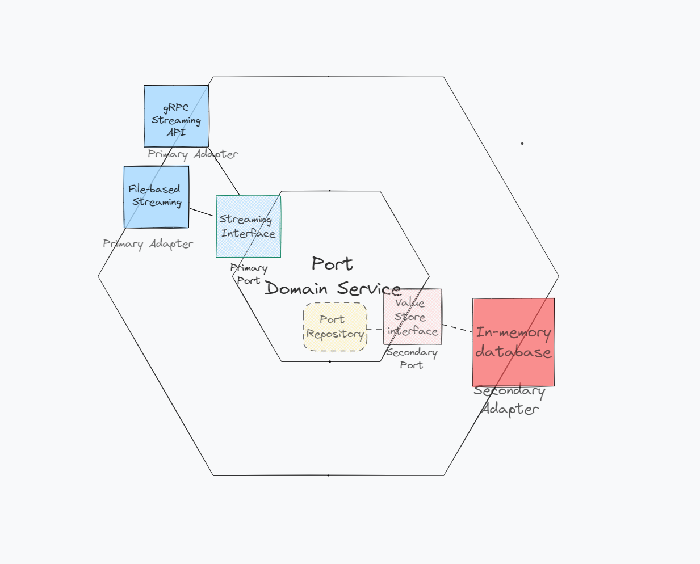

# Port-Service
 
## Introduction
This project is a Go-based microservices application. It demonstrates proficiency in hexagonal architecture, gRPC, Domain-Driven Design (DDD), and various streaming and data persistence techniques. The application provides two key adapter implementations: a gRPC streaming API and filesystem-based data streaming.

## Features
- **gRPC Streaming API**: Implements a gRPC-based streaming service, allowing efficient data transfer over the network.
- **Filesystem Data Streaming**: Supports streaming data from the filesystem, showcasing adaptability to different data sources.
- **In-Memory Database**: Utilizes an in-memory database for temporary data storage, ensuring fast data access.
- **Hexagonal Architecture**: Adheres to hexagonal architecture principles, promoting loose coupling and high modularity.
- **Domain-Driven Design (DDD)**: Implements DDD principles, aligning the solution with business requirements.
- **Debugging Capabilities**: Includes a feature to test the presence of specific keys by setting the `debugkey` flag or environment variable, which periodically attempts to retrieve the key from storage.
- **Persistent Data Storage**: Currently supports only persistent data storage without retrieval capabilities.
- **Docker Support**: Includes a Dockerfile for easy containerization and deployment.

## Architecture
The project is structured following the hexagonal architecture model, divided into:
- **Ports**: Defined in `port-for-ships.go` and `port-for-ships_repository.go`, representing the primary interfaces for our application.
- **Adapters**: Including `in-memory-db.go` for in-memory storage, `grpc-streaming.go` and `filesystem-streamer.go` for data streaming, and `store.go` for data persistence.
- **Domain**: Core business logic encapsulated within the service implementation.

## How to try it out
This application supports two modes of operation:

### gRPC Server
To test the gRPC server:
```
go run cmd/server/main.go -grpc=true
```
This will start the gRPC server on port 8080. You can then run the gRPC client under `testing/grpcclient` to connect and test streaming port data.

### gRPC Client
A test gRPC client is provided under `testing/grpcclient/client.go`.
To test connectivity and streaming:
Start the gRPC server:
```
go run cmd/server/main.go -grpc=true
```
In another terminal, run the test client:
```
go run testing/grpcclient/client.go
```
This will connect to the gRPC server on port 8080 and print out streaming port data.
The test client provides a way to validate the end-to-end streaming functionality through gRPC.

### File Streaming
To test file streaming:
```
go run cmd/server/main.go -grpc=false
```
This will stream port data from the specified JSON file.

### Debug Key Lookup
To test lookup of a specific key, pass the `-debugkey` flag:
```
go run cmd/server/main.go -debugkey=KEY
```
This will periodically print out whether the key is found in the in-memory database. Useful for testing data is being streamed and stored correctly.

## Running the Docker Container

To run the Docker container with your specific file and flags, follow these steps:

1. Make sure you have [Docker](https://www.docker.com/get-started) installed on your machine.

2. Open a terminal or command prompt.

3. Run the following command, replacing the file path on your local machine as needed for e.g. file-based streaming:

   ```bash
   docker run -p 8080:8080 -v /path/to/your/local/file:/path/inside/container/ports.json ghcr.io/tillknuesting/port-service:main --grpc=false --file=/path/inside/container/ports.json

Make sure to adjust the file path (/path/to/your/local/file) to point to the location of the ports.json on your local machine.
